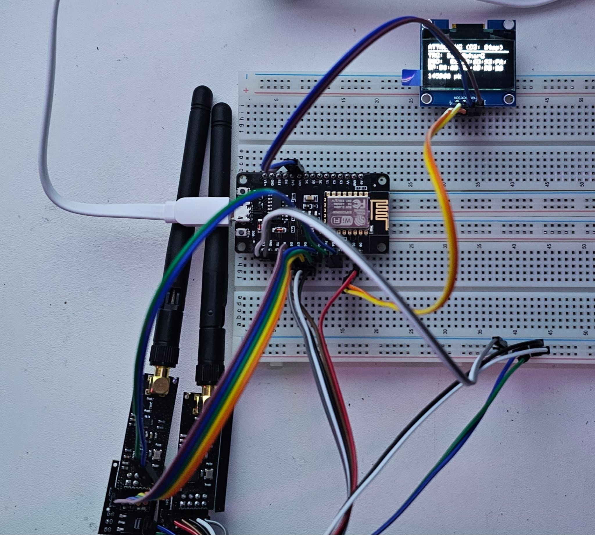

# Hardware
Some smalltime Hardware experiments, ESP, Raspi Pico, NRF24, ... nothing fancy.

## Jammers
### Inspiration
- https://cifertech.net/rf-clown-your-portable-ble-bluetooth-jamming-tool/
- https://github.com/cifertech/RF-Clown
- https://github.com/SpacehuhnTech/esp8266_deauther/

### Results
- bruteforceJammer.ino (similar to RF Clown)
- deauthJammer.ino (took code parts from SpaceHuhn deauther)
  
We only had ESP8266 available, so we built several custom versions with our own code. While we managed to get it all working, including nice little OLED, the results were... don't wanna hurt anyone's feelings, but these < 1mW RF adapters do exactly nothing on modern Wifi. 

